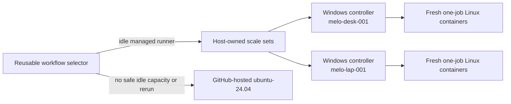

# ci-runner

`ci-runner` is the Windows host controller and disposable Linux worker image
for a small, demand-scaled GitHub Actions fleet. Its purpose is to move eligible
private-repository CI from paid GitHub-hosted runners onto `melo-desk-001` and
`melo-lap-001` without creating a second CI contract or making local capacity a
hard dependency.

The production architecture is under implementation and must remain routed
`hosted-only` until the canary gates pass. The former Compose/restart-in-place
implementation is migration evidence only; it is not the supported lifecycle.

## Runtime architecture



Each host owns an independent scale-set ID and listener session. Organization
hosts advertise the same workflow label, so GitHub can distribute work and
reassign a job before acquisition if one host disappears. The controller uses
GitHub's official [Runner Scale Set Client](https://github.com/actions/scaleset)
outside Kubernetes and scales from its authoritative `TotalAssignedJobs`
statistic.

Every admitted job gets a new container from the digest-pinned official
`actions/actions-runner` image. The controller streams the one-job JIT payload
over attached stdin; the entrypoint exposes it to the official runner through
the documented `ACTIONS_RUNNER_INPUT_JITCONFIG` input. The payload is absent
from Docker's persistent config and `docker inspect`. The container has no host
mount, Docker socket, device, GPU, persistent home, work directory, temp, or
tool cache, and is removed after terminal diagnostics are copied out.

The Windows process is the only control plane. GitHub App keys are protected
with current-user DPAPI and never enter worker containers. The controller talks
only to the fixed local Docker Engine endpoint and requires a Linux/amd64
engine; `DOCKER_HOST`, TLS, and API-version environment overrides are ignored.

## Routing and fallback contract

Eligible workflows call the central selector in
[`melodic-software/ci-workflows`](https://github.com/melodic-software/ci-workflows).
It chooses local capacity only when an exact managed label and runner-name
prefix identify an online, idle, ephemeral runner. Missing configuration,
missing credentials, invalid API data, timeouts, API failures, public or fork
workflows, Dependabot, and explicit `hosted-only` policy all route hosted.

A full workflow rerun has `github.run_attempt > 1` and always routes hosted.
This is the recovery path for the irreducible case where both local hosts
disappear after local selection. GitHub does not provide an atomic
hosted-or-self-hosted `runs-on` operator, so simultaneous selector jobs can
observe the same idle runner and briefly queue. The hosted queue monitor reports
that condition; it never cancels or replays work automatically.

The selector's two-minute `ubuntu-slim` job is independent of downstream job
timeouts. A selected build/test job can run longer than the selector and longer
than `ubuntu-slim`'s 15-minute platform limit.

Authoritative behavior:

- [GitHub self-hosted routing](https://docs.github.com/en/actions/reference/runners/self-hosted-runners#routing-precedence-for-self-hosted-runners)
- [Runner scale-set high availability](https://docs.github.com/en/actions/how-tos/manage-runners/use-actions-runner-controller/deploy-runner-scale-sets#high-availability-and-automatic-failover)
- [`runs-on` syntax](https://docs.github.com/en/actions/reference/workflows-and-actions/workflow-syntax#jobsjob_idruns-on)
- [`ubuntu-slim` limits](https://docs.github.com/en/actions/reference/runners/github-hosted-runners)

## Host lifecycle

`ci-runner.exe` is the only operator interface. With no subcommand it opens the
interactive menu; the same operations are available for automation:

```text
ci-runner host
ci-runner host status [--json]
ci-runner host enable [--wait]
ci-runner host disable [--wait|--detach]
ci-runner host game [--wait|--detach]
ci-runner host doctor [--json]
ci-runner host logs [--follow|--job ID|--cleanup]
ci-runner host force-stop
ci-runner secret import --file PATH
```

Modes are persisted separately from checked-in configuration:

- `enabled` starts Docker when policy allows, advertises capacity, and maintains
  configured warm workers;
- `disabled` advertises zero, drains CI, and removes idle workers without
  touching unrelated Docker or WSL workloads;
- `gaming` drains CI, stops Docker Desktop, shuts down every WSL distribution,
  verifies both are down, and remains down across logons.

No normal timeout implies force. Busy jobs finish naturally, including drains
longer than the warning threshold. `force-stop` is a separate destructive path
that inventories affected jobs and requires typed confirmation. `Ctrl+C` while
watching a drain detaches from the display; it does not cancel the drain.

The windowless `ci-runner-controller.exe` runs from a current-user logon task
because Docker Desktop is user-session software. Task Scheduler only restarts
the controller. Battery, resource admission, drain, Docker Desktop, and WSL
policy remain in the shared Go state machine.

## Configuration and ownership

The checked-in, nonsecret host YAML is owned by
[`kyle-sexton/provisioning`](https://github.com/kyle-sexton/provisioning) and is
installed as `%LOCALAPPDATA%\ci-runner\config.yaml`. The strict parser rejects
unknown properties, unsupported schemas, invalid units, duplicate targets,
unsafe paths, and inconsistent thresholds.

Provisioning verifies ownership boundaries through the product rather than
parsing YAML itself. `config validate --json` returns the normalized
`release.compatibilityManifest` and `paths` (`secrets`, `state`, `logs`, and
`diagnostics`) contract. `host status --json` returns the authenticated live
controller's PID, exact version, phase, shutdown state, and job counts under
`controller`; provisioning requires a new nonzero PID and the requested version
before committing an install transaction.

Mutable local state is separate:

```text
%LOCALAPPDATA%\ci-runner\
  state\desired.json       # user-owned mode and temporary capacity override
  state\observed.json      # controller heartbeat, pools, workers, and problems
  state\jobs.json          # exact job-to-artifact correlation
  secrets\                 # current-user DPAPI-protected App keys
  logs\controller\         # structured JSON Lines controller events
  logs\workers\            # externally captured runner stdout/stderr
  diagnostics\             # copied runner _diag archives
```

Permanent capacity and threshold changes are YAML changes, never source-code
changes. A menu capacity override is local state and can be reset to the
checked-in value. Provisioning must not overwrite desired mode.

One diagnostics policy governs both copied runner stdout and compressed `_diag`
archives. `maxFileSize`, `rawDiagnosticMaxInput`, retention, total-cap, and
cleanup cadence are strict host configuration. Startup retention runs only
after every managed active or exited container has been adopted. The explicit
`host logs --cleanup` command first inventories the fixed local Docker endpoint
and refuses to run if that safety inventory is unavailable.

Default worker parity is 2 CPU, 8 GiB memory, no additional swap, 4096 PIDs,
and no devices. Admission also honors configurable host memory/CPU thresholds,
hysteresis, global worker limits, and laptop AC-only policy. Active workers are
never killed to reclaim resources.

## Credential boundary

The organization host App has only organization **Self-hosted runners: write**;
each physical host gets a distinct private key. A separate observer App is
read-only. Personal-repository host credentials are introduced only after the
organization soak gate.

`ci-runner secret import` validates RSA PKCS#1/PKCS#8 PEM, BitLocker protection,
current-user DPAPI protection, and exact current-user/SYSTEM ACLs. The key is
decrypted only in controller memory. Rotation overlaps old and new keys until
the new key can create a JIT runner, then revokes the old key.

The disposable worker necessarily contains its own decoded one-job runner
credentials because that is how the stock GitHub runner connects and executes a
job under one identity. Workflow code must be treated as able to inspect those
ephemeral credentials. The enforced boundary is that no reusable App key,
observer key, controller JWT, installation token, Docker control socket, or host
filesystem enters the worker.

See [the worker-image contract](docs/worker-image.md) and GitHub's
[self-hosted-runner security guidance](https://docs.github.com/en/actions/reference/security/secure-use#hardening-for-self-hosted-runners).

## Supported workload

V1 is Linux x64 only. Versioned runtimes come from the same official setup
actions used on `ubuntu-24.04`; the image adds only the documented compatibility
baseline. GitHub-managed Actions caches continue to work across hosted and
self-hosted execution, but cache content is untrusted and must contain no
secrets.

These workloads stay GitHub-hosted:

- public repositories and fork pull requests;
- Windows jobs;
- service containers, job containers, Testcontainers, Docker actions, or jobs
  requiring a Docker socket;
- GPU/device/privileged workloads;
- broad cross-repository write/control-plane jobs;
- publication of this controller and worker image.

See [GitHub dependency caching](https://docs.github.com/en/actions/concepts/workflows-and-actions/dependency-caching)
and [Docker resource constraints](https://docs.docker.com/engine/containers/resource_constraints/).

## Build, release, and rollback

Local gates include module verification, vet, unit and race tests, Windows and
Linux builds, `govulncheck`, Actionlint, Zizmor, strict configuration tests, and
the live worker-image verifier. Release tags first run the complete read-only
gate against the exact tagged source. Only a dependent publication job receives
`contents`, `packages`, `attestations`, and OIDC write permissions.

Releases produce an immutable pair:

- versioned Windows ZIP and SHA-256 checksums;
- exact OCI worker image digest;
- controller and worker SBOM/provenance attestations;
- a compatibility manifest tying source SHA, controller, image, runner, Scale
  Set Client, Go, PowerShell, Buildx, BuildKit, and SBOM-generator pins together.

Dependencies and Actions are exact pins. Daily official-source drift evidence
opens an issue within 24 hours and hard-fails after 14 days; updates remain
reviewed and are never auto-merged. Deployment uses a versioned install
directory plus `current` junction and retains the latest three known-good pairs.

Rollback order is: set routing `hosted-only`, drain without killing work,
restore the prior immutable pair, restore the prior reusable-workflow SHA if
needed, then rerun affected workflows hosted.

## Further documentation

- [Worker image and isolation contract](docs/worker-image.md)
- [Queue-monitor behavior and scheduler limits](docs/queue-monitor.md)
- [Immutable releases, freshness, and rollback](docs/releases.md)
