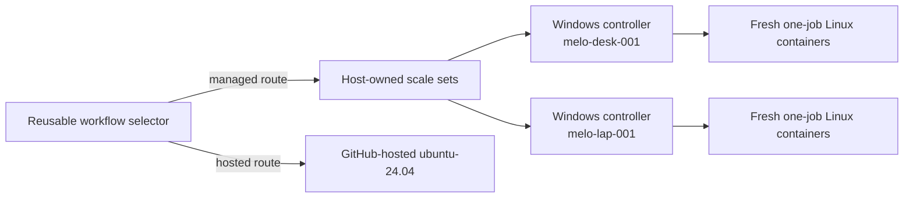

# ci-runner

`ci-runner` is the Windows host controller and disposable Linux worker image
for a small, demand-scaled GitHub Actions fleet. Its purpose is to move eligible
private-repository CI from paid GitHub-hosted runners onto `melo-desk-001` and
`melo-lap-001` without creating a second CI contract. The centrally governed
routing policy decides whether local capacity is preferred, required, or
bypassed.

Both hosts passed their acceptance gates and serve the
organization's governed `self-hosted-only` routing default. The former
Compose/restart-in-place implementation is retired and its files are deleted;
the only production credential entry point is
`ci-runner secret import --file PATH`.

## Runtime architecture



Each host owns an independent scale-set ID and listener session. Organization
hosts advertise the same workflow label, so GitHub can distribute work and
reassign a job before acquisition if one host disappears. The controller uses
GitHub's official [Runner Scale Set Client](https://github.com/actions/scaleset)
outside Kubernetes and scales from its authoritative `TotalAssignedJobs`
statistic.

Every admitted job gets a new container from the digest-pinned official
`actions/actions-runner` image. The controller streams the one-job JIT payload
over attached stdin; the entrypoint exposes it to the official runner through
the documented `ACTIONS_RUNNER_INPUT_JITCONFIG` input. The payload is absent
from Docker's persistent config and `docker inspect`. The container has no host
mount, Docker socket, device, GPU, persistent home, work directory, temp, or
tool cache, and is removed after terminal diagnostics are copied out.

The Windows process is the only control plane. GitHub App keys are protected
with current-user DPAPI and never enter worker containers. The controller talks
only to the fixed local Docker Engine endpoint and requires a Linux/amd64
engine; `DOCKER_HOST`, TLS, and API-version environment overrides are ignored.

## Routing and fallback contract

Eligible workflows call the central selector in
[`melodic-software/ci-workflows`](https://github.com/melodic-software/ci-workflows).
The selector owns routing and fallback; this controller only supplies runners
inside its governed name and label namespaces. Immutable selector revisions are
reviewed and allowlisted by the
[`standards` runner policy](https://github.com/melodic-software/standards/blob/main/components/runner-policy/README.md):

- `hosted-only` returns the approved GitHub-hosted image;
- `prefer-self-hosted` chooses a safe online managed namespace and otherwise
  falls back hosted; and
- `self-hosted-only` permits only its reviewed managed label and never falls
  back to paid hosted capacity.

Adaptive selection treats any matching online ephemeral runner as fleet
liveness. A busy runner can therefore keep the managed route eligible, and
GitHub queues the job until matching capacity is available. Security guards,
invalid inventory, missing adaptive credentials, and API failures retain the
selector's documented fail-open or fail-closed behavior for the chosen policy.

A rerun is not an automatic hosted fallback. Recovery from unavailable local
capacity first uses the audited
[`github-iac` routing-control procedure](https://github.com/melodic-software/github-iac/blob/main/README.md#local-ci-routing-governance)
to make the affected repository's effective policy `hosted-only` and verify the
readback. Then cancel the affected run and choose **Re-run all jobs** to
guarantee that the selector executes again; confirm its output selects hosted
capacity. Do not use a failed-job or single-job rerun for this recovery because
partial-rerun dependency behavior does not guarantee a fresh selector decision.
A `workflow_dispatch` creates a separate run with different event and ref
context; it does not recover the original pull-request check. The hosted queue
monitor reports the condition; it
never changes policy, cancels, or replays work automatically. GitHub documents
the distinct [full and partial rerun
operations](https://docs.github.com/en/actions/how-tos/manage-workflow-runs/re-run-workflows-and-jobs)
and [`workflow_dispatch` event
context](https://docs.github.com/en/actions/reference/workflows-and-actions/events-that-trigger-workflows#workflow_dispatch).

The adaptive/hosted selector's two-minute `ubuntu-slim` control job is
independent of downstream job timeouts. Strict `self-hosted-only` selection
keeps that control job on the reviewed managed label so it does not spend hosted
minutes. A selected build/test job can outlive either selector control path.

Authoritative behavior:

- [GitHub self-hosted routing](https://docs.github.com/en/actions/reference/runners/self-hosted-runners#routing-precedence-for-self-hosted-runners)
- [Runner scale-set high availability](https://docs.github.com/en/actions/how-tos/manage-runners/use-actions-runner-controller/deploy-runner-scale-sets#high-availability-and-automatic-failover)
- [`runs-on` syntax](https://docs.github.com/en/actions/reference/workflows-and-actions/workflow-syntax#jobsjob_idruns-on)
- [`ubuntu-slim` limits](https://docs.github.com/en/actions/reference/runners/github-hosted-runners)

## Host lifecycle

`ci-runner.exe` is the only operator interface. With no subcommand it opens the
interactive menu; the same operations are available for automation:

```text
ci-runner host
ci-runner host status [--json]
ci-runner host enable [--wait]
ci-runner host disable [--wait|--detach]
ci-runner host game [--wait|--detach]
ci-runner host doctor [--json] [--include-elevated]
ci-runner host logs [--follow|--job ID|--cleanup]
ci-runner host force-stop
ci-runner host controller restart
ci-runner host controller stop-for-update
ci-runner secret import --file PATH
```

Modes are persisted separately from checked-in configuration:

- `enabled` starts Docker when policy allows, advertises capacity, and maintains
  configured warm workers;
- `disabled` advertises zero, drains CI, and removes idle workers without
  touching unrelated Docker or WSL workloads;
- `gaming` drains CI, stops Docker Desktop, shuts down every WSL distribution,
  verifies both are down, and remains down across logons.

No normal timeout implies force. Busy jobs finish naturally, including drains
longer than the warning threshold. `force-stop` is a separate destructive path
that inventories affected jobs and requires typed confirmation. `Ctrl+C` while
watching a drain detaches from the display; it does not cancel the drain.

`host doctor` is non-elevating by default. It reports the BitLocker check as
skipped while still running every ordinary diagnostic. `--include-elevated`
explicitly enables the full BitLocker verification and writes a warning before
the verifier can open an Administrator UAC prompt; use it only in an interactive
session where that prompt is expected.

`host doctor` also surfaces pending-OS-reboot state from the standard registry
signals (component servicing, session-manager pending file renames, and Windows
Update). Because updates auto-install but the host never auto-reboots while a
session exists, a pending reboot is expected operational state the operator
finishes during a deliberate drain window: the check is advisory, renders as
`WARN`, and never degrades the doctor exit code.

The windowless `ci-runner-controller.exe` runs from a current-user logon task
because Docker Desktop is user-session software. A controller restart first
uses the authenticated control plane to bind the shutdown reservation to the
preflight PID, version, and job counts, then advertises zero capacity and lets
every assigned or active job finish. Only after every pool has two confirmed
zero-capacity observations, no active worker remains, and the message sessions,
worker runtime, and control server close successfully does the controller write
an ACL-hardened, atomic completion receipt bound to the authenticated request
ID, old PID, and exact version and emit its dedicated restart exit code. The CLI
waits on that exact process handle and requires both the exit code and matching
durable receipt before it can touch Task Scheduler.

The CLI then asks Task Scheduler to run the canonical `ci-runner-fleet` task
at most four times with exponential backoff. Those bounded retries close the
`MultipleInstances=IgnoreNew` race while Task Scheduler finishes the prior
instance. Success still requires the authenticated control plane to report a
different PID at the exact expected version. An unavailable initial control
plane, an ordinary controller failure, or a missing or mismatched receipt never
authorizes a task start.

The CLI invokes the existing task through a direct hidden `schtasks.exe /Run`
child process. It does not launch the controller directly, open another console
window, invoke a shell, request elevation or UAC, or terminate the draining
controller. Battery, resource admission, drain, Docker Desktop, and WSL policy
remain in the shared Go state machine.

## Configuration and ownership

The checked-in, nonsecret host YAML is owned by
[`melodic-software/provisioning`](https://github.com/melodic-software/provisioning) and is
installed as `%LOCALAPPDATA%\ci-runner\config.yaml`. The strict parser rejects
unknown properties, unsupported schemas, invalid units, duplicate targets,
unsafe paths, inconsistent thresholds, and explicit null or blank target worker
resource sections and fields. YAML merge keys (`<<`) are rejected everywhere so
inheritance cannot bypass those checks.

Provisioning verifies ownership boundaries through the product rather than
parsing YAML itself. `config validate --json` returns the normalized
`release.compatibilityManifest` and `paths` (`secrets`, `state`, `logs`, and
`diagnostics`) contract. `host status --json` returns the authenticated live
controller's PID, exact version, phase, shutdown state, and job counts under
`controller`; provisioning requires a new nonzero PID and the requested version
before committing an install transaction.

Mutable local state is separate:

```text
%LOCALAPPDATA%\ci-runner\
  state\desired.json       # user-owned mode and temporary capacity override
  state\observed.json      # controller heartbeat, pools, workers, and problems
  state\jobs.json          # exact job-to-artifact correlation
  state\restart-completed.json # last authenticated restart completion receipt
  secrets\                 # current-user DPAPI-protected App keys
  logs\controller\         # structured JSON Lines controller events
  logs\workers\            # externally captured runner stdout/stderr
  diagnostics\             # copied runner _diag and terminal cgroup evidence
```

Permanent capacity and threshold changes are YAML changes, never source-code
changes. A menu capacity override is local state and can be reset to the
checked-in value. Provisioning must not overwrite desired mode.

One diagnostics policy governs both copied runner stdout and compressed `_diag`
archives. `maxFileSize`, `rawDiagnosticMaxInput`, retention, total-cap, and
cleanup cadence are strict host configuration. Startup retention runs only
after every managed active or exited container has been adopted. The explicit
`host logs --cleanup` command first inventories the fixed local Docker endpoint
and refuses to run if that safety inventory is unavailable.

Optional OpenTelemetry export uses a reviewed `telemetry:` host configuration
block, with standard `OTEL_*` environment variables retained for legacy and
exporter-specific settings. It is disabled without explicit configuration and emits controller reconcile
spans and low-cardinality fleet, capacity, worker, job, host-pressure, gate, and
lifecycle metrics. Exporter failures are locally logged and cannot change
capacity, drain workers, cancel jobs, or stop the controller. Runner names,
container IDs, job IDs, credentials, and arbitrary error text never become
metric attributes. See [OpenTelemetry observability](docs/observability.md) for
the exact enablement, metric, cancellation, and failure-isolation contracts.

Default worker parity is 2 CPU, 8 GiB memory, no additional swap, 4096 PIDs,
and no devices. Admission also honors configurable host memory/CPU thresholds,
hysteresis, global worker limits, and laptop AC-only policy. Active workers are
never killed to reclaim resources.

An enabled pool can keep one excess healthy idle runner as bounded burst
inventory instead of advertising zero capacity for the whole pool to retire it.
All pools share the host-wide advertised-capacity budget; when no safe slot is
available, the excess runner falls back to quiescence. The next admitted job
naturally consumes retained ephemeral inventory. Larger downscales and explicit
zero-capacity modes retain the two-poll quiescence requirement before exact
runner deregistration, so assignment races still fail closed.

While a GitHub listener poll is open, the controller refreshes managed worker
inventory on the normal reconciliation cadence. A completed ephemeral container
cancels the stale poll immediately so authoritative assignments can start
replacement workers without waiting for the listener timeout.

Targets may optionally override individual fields from the global
`resources.worker` profile. Every omitted field inherits the global value; the
effective profile must still satisfy the same CPU, memory, total memory-plus-swap,
and PID validation. For example, this relevant excerpt keeps the ordinary pool
at 2 CPU/8 GiB while giving a CodeQL pool a larger profile:

```yaml
schemaVersion: 2

resources:
  maximumConcurrentWorkers: 5
  minimumAvailableMemoryPercent: 25
  memoryCapacityIncreaseMarginPercent: 25
  worker:
    cpus: 2
    memory: 8GiB
    memorySwap: 8GiB
    pids: 4096
github:
  targets:
    - id: ordinary
      # The remaining required target identity and capacity fields are omitted.
    - id: codeql
      resources:
        worker:
          cpus: 4
          memory: 24GiB
          memorySwap: 24GiB
          pids: 8192
```

Host admission computes the byte headroom above the physical-memory floor and
allocates prospective starts in target-priority order, charging each start's
effective memory profile. A larger target that does not fit is skipped so a
smaller eligible target can still run. Successful mixed-profile starts are also
reserved by their exact memory limits against fresh-but-potentially-stale host
observations for the rest of that reconciliation step. The reservation sum
saturates fail-closed, and `maximumConcurrentWorkers` remains the host-wide
ceiling. Insufficient memory headroom caps only prospective starts; it does not
activate the global resource gate or retire healthy existing capacity. Invalid
resource observations and sustained high CPU remain global gates. Target
profiles change only Docker CPU, memory, memory-plus-swap, and PID limits. They
cannot add the Docker socket, privileged mode, devices, or host mounts.

Listener capacity uses a per-pool memory Schmitt trigger. A decrease crosses the
raw worker-memory boundary immediately, preserving the fail-closed admission
contract. An increase must additionally clear
`memoryCapacityIncreaseMarginPercent` of that target's effective worker memory;
inside the band, the last advertised capacity is retained. The margin applies to
capacity growth only and is not charged as a permanent memory reservation.
Schema version 1 remains accepted without the margin and preserves the legacy
zero-margin behavior; the margin is required only by schema version 2.

## Credential boundary

The organization host App has only organization **Self-hosted runners: write**;
each physical host gets a distinct private key. A separate observer App is
read-only. Personal-repository host credentials are introduced only after the
organization soak gate.

`ci-runner secret import` validates RSA PKCS#1/PKCS#8 PEM, BitLocker protection,
current-user DPAPI protection, and exact current-user/SYSTEM ACLs. Before it
reports success, it reads the protected destination back under the current
identity and verifies its fingerprint and import metadata. On Windows, the
import keeps the exact source file open with read and delete access while
withholding write/delete sharing. It rechecks that file identity at commit and
uses handle-bound deletion, so a moved, missing, or replacement pathname is
never deleted as though it were the imported PEM. If that identity check or
deletion is ambiguous, the verified DPAPI destination is retained and the
command fails with explicit manual-cleanup instructions. Failures before the
source-deletion commit leave the PEM untouched and roll back the destination
where possible. Any failed rollback or incomplete exclusive write that cannot
be removed is also reported as requiring manual cleanup and is never presented
as success.

The reported fingerprint is standard Base64 of the SHA-256 digest of the DER
public key. This is the exact format produced by GitHub's documented
[`openssl` verification command](https://docs.github.com/en/apps/creating-github-apps/authenticating-with-a-github-app/managing-private-keys-for-github-apps#verifying-private-keys),
so the CLI value can be compared directly with the fingerprint in the GitHub
App's settings.

Protected-secret schema v2 records that Base64 fingerprint. The loader remains
backward compatible with schema v1 files, which stored the same SPKI SHA-256
digest as lowercase hexadecimal, and reports their fingerprint in canonical
Base64 after validation. New imports never write the legacy representation.

Source cleanup is ordinary filesystem deletion. On Windows, deletion can fail
for reasons such as an incompatible open handle, a read-only file, or
insufficient access, and this product does not weaken those protections or
silently continue. The identity lock follows Microsoft's documented
[`CreateFile` sharing contract](https://learn.microsoft.com/en-us/windows/win32/api/fileapi/nf-fileapi-createfilew),
where withholding delete sharing also prevents rename, and commit uses
[`SetFileInformationByHandle`](https://learn.microsoft.com/en-us/windows/win32/api/fileapi/nf-fileapi-setfileinformationbyhandle)
with `FileDispositionInfo`, which requires delete access and deletes the opened
file object when its handle closes. Import is deliberately Windows-only; it
does not emulate this guarantee with a pathname-only unlink on other systems.
File deletion is not a forensic secure erase or a claim of media sanitization.
Use an appropriate sanitization process when the storage medium is reused or
disposed of, following [NIST SP 800-88 Rev. 2](https://csrc.nist.gov/pubs/sp/800/88/r2/final).
The key is decrypted only in controller memory. Rotation overlaps old and new
keys until the new key can create a JIT runner, then revokes the old key.

The disposable worker necessarily contains its own decoded one-job runner
credentials because that is how the stock GitHub runner connects and executes a
job under one identity. Workflow code must be treated as able to inspect those
ephemeral credentials. The enforced boundary is that no reusable App key,
observer key, controller JWT, installation token, Docker control socket, or host
filesystem enters the worker.

See [the worker-image contract](docs/worker-image.md) and GitHub's
[self-hosted-runner security guidance](https://docs.github.com/en/actions/reference/security/secure-use#hardening-for-self-hosted-runners).

## Supported workload

V1 is Linux x64 only. Versioned runtimes come from the same official setup
actions used on `ubuntu-24.04`; the image adds only the documented compatibility
baseline. GitHub-managed Actions caches continue to work across hosted and
self-hosted execution, but cache content is untrusted and must contain no
secrets.

These workloads stay GitHub-hosted:

- public repositories and fork pull requests;
- Windows jobs;
- service containers, job containers, Testcontainers, Docker actions, or jobs
  requiring a Docker socket;
- GPU/device/privileged workloads;
- broad cross-repository write/control-plane jobs;
- publication of this controller and worker image.

See [GitHub dependency caching](https://docs.github.com/en/actions/concepts/workflows-and-actions/dependency-caching)
and [Docker resource constraints](https://docs.docker.com/engine/containers/resource_constraints/).

## Build, release, and rollback

Pull requests and pushes delegate Go quality to the exact-SHA-pinned reusable
workflow in `melodic-software/ci-workflows`. It runs the reviewed analyzer set
on native Linux and Windows, [module tidiness and verification](https://go.dev/ref/mod)
plus
[race-enabled tests](https://go.dev/doc/articles/race_detector) on Linux,
ordinary tests on Windows, and authenticated
[`govulncheck`](https://go.dev/doc/security/vuln/) analysis. The repository-local
Go build lane only cross-compiles the two Windows executables on Ubuntu; it does
not repeat those checks. Committed fuzz seeds run in ordinary tests, while the
weekly schedule and manual dispatch actively [fuzz](https://go.dev/doc/tutorial/fuzz)
both targets for 30 seconds each.

Other gates include Actionlint, Zizmor, strict configuration tests, and the live
worker-image verifier. Release tags first rerun the complete read-only gate
against the exact tagged source. Only the dependent publication job
receives the combined job-scoped `contents:write`, `packages:write`,
`attestations:write`, `artifact-metadata:write`, and `id-token:write` grant; the
later image-promotion job retains only `contents:read` and `packages:write`.
Worker provenance explicitly requests an organization artifact storage record,
and publication fails closed unless the pinned attestation action returns at
least one numeric storage-record ID.

Releases produce an immutable pair:

- versioned Windows ZIP and SHA-256 checksums;
- exact OCI worker image digest;
- controller and worker SBOM/provenance attestations;
- a compatibility manifest tying source SHA, controller, image, runner, Scale
  Set Client, Go, PowerShell, Buildx, BuildKit, and SBOM-generator pins together.

Dependencies and Actions are exact pins. Daily official-source drift evidence
opens an issue within 24 hours and hard-fails after 14 days; updates remain
reviewed and are never auto-merged. Deployment uses a versioned install
directory plus `current` junction and retains the latest three known-good pairs.

Rollback order is: set routing `hosted-only`, drain without killing work,
restore the prior immutable pair, restore the prior reusable-workflow SHA if
needed, then use **Re-run all jobs** for affected workflows and confirm hosted
selection.

## Further documentation

- [Worker image and isolation contract](docs/worker-image.md)
- [Queue-monitor behavior and scheduler limits](docs/queue-monitor.md)
- [OpenTelemetry observability](docs/observability.md)
- [Immutable releases, freshness, and rollback](docs/releases.md)
- [Deferred capabilities and non-workaround boundaries](docs/roadmap.md)
